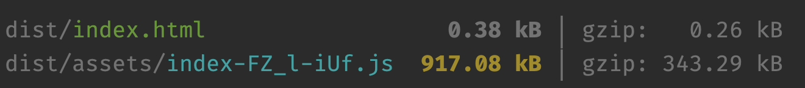
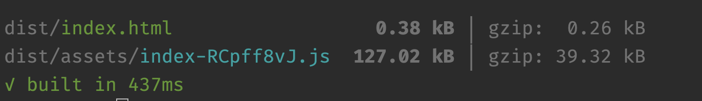
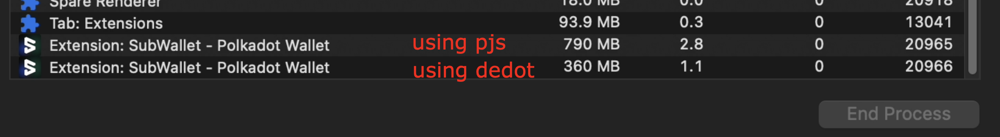
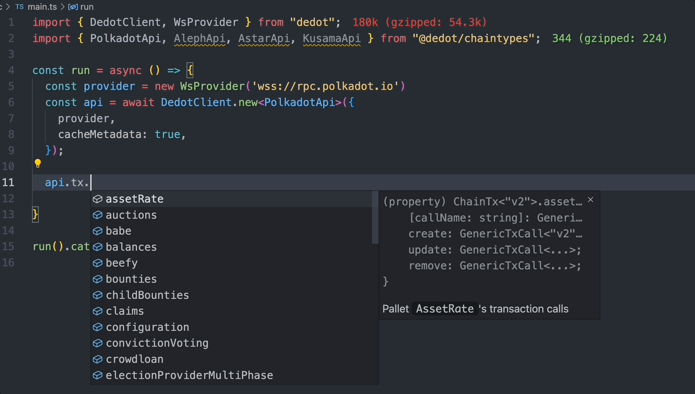
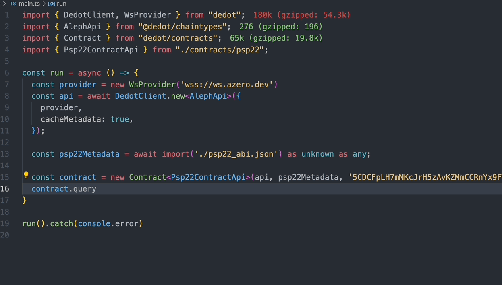

We are thrilled to introduce [Dedot](https://dedot.dev), the next-generation JavaScript client for Polkadot and Substrate-based blockchains. Designed to elevate the dapp development experience, Dedot is rebuilt from the ground up to be lightweight and tree-shakable, offering precise Types and APIs suggestions for individual Substrate-based blockchains and ink! Smart Contracts. Dedot also helps dapps efficiently connect to multiple chains simultaneously as we head toward a seamless multi-chain future.

## Overview

Dapps have always been a crucial part of any blockchain ecosystem, providing users with a means to connect and interact with blockchain networks. Given the complex nature of interacting with Substrate-based blockchains, developers need to focus on business logic rather than connection intricacies. Thus, a middle layer between dapps and blockchain nodes to facilitate these connections and interactions is essential.

`@polkadot/api` (`pjs`) has been widely adopted and integrated into most dapps within the ecosystem. It has effectively simplified the process of connecting applications to networks by abstracting the complexities of interacting with Substrate-based blockchains and handling the scale-codec serialization process.

However, through our development experience, benchmarking, and profiling, we discovered that `@polkadot/api` has several limitations that may hinder developers from creating optimal dapps for the Polkadot ecosystem.

## Limitations of [Polkadot.js API](https://github.com/polkadot-js/api) (aka `@polkadot/api`)
###  Large bundle-size

I believe any developer using `@polkadot/api` to build their dapps will recognize this issue firsthand. `@polkadot/api` has tight dependencies on wasm-blob (crypto utilities) and `bn.js` for handling BigInt numbers. Additionally, it comes with a large number of [type defs](https://github.com/polkadot-js/api/tree/master/packages/types/src/interfaces) by default, even if the dapp doesn't use most of those APIs or information. This makes the entire bundle size of dapps quite large, resulting in a poor user experience as users have to wait longer before they can start interacting with the dapp.

Here is the bundle size of a very simple dapp built using `@polkadot/api` (with no other dependencies) that performs two relatively trivial steps: 1) initializing the API instance, and 2) fetching the account balance. As shown in the image below, the pre-compression size is close to 1MB, and even after gzip compression, the size remains quite large for such a simple dapp.

### High memory consumption
This is the issue that wallet providers or any dapps that need to connect to a large amount of networks at the same time might get into. For example, connecting to 100 RPC endpoints at the same time can potentially consume around 800MB of memory. Through benchmarking and profiling, we've pinpointed the root cause of this issue, long story short: its type system. We have a very detailed benchmarking and analysis in the [proposal](https://grants.web3.foundation/applications/delightfuldot) to Web 3 Foundation Grants Program to build `dedot` (formerly named DelightfulDOT) almost a year ago.

As we're heading toward a multi-chain future, we believe the ability to connecting to multiple blockchain networks at the same time efficiently and effectively is very important.

### Limitations in Types & APIs suggestions for individual chains
`@polkadot/api` only comes with a [default types & apis suggestions](https://github.com/polkadot-js/api/tree/master/packages/api-augment) for only Polkadot & Kusama. This creates a very bad DX especially for new developers working on parachains or solochains with different business logic coming from different pallets & runtime apis.

I remembered my first time working with `@polkadot/api` to interact with my custom substrate blockchain. I was having a really hard time to define custom runtime-api typedefs and figure out which api to call in order to interact with my pallet (extrinsics & storage). I was also struggled on how to construct a struct, a tuple or especially an enum to pass those as parameters into the api. Give me a thump up if you are also in my situation the first time working with `@polkadot/api`. :)

## Dedot comes to address those issues
### Small bundle-size and tree-shakable
Dedot was rebuilt from scratch to avoid the pitfalls faced by `@polkadot/api` like type defs system (thanks god! we have metadata v14 & v15). We eliminated dependencies on wasm-blob and now use the native [BigInt](https://developer.mozilla.org/en-US/docs/Web/JavaScript/Reference/Global_Objects/BigInt) primitive instead of relying on `bn.js`.

As a result, the same dead simple dapp that has the size of nearly ~1MB built with `@polkadot/api` earlier, now the size is down to 127kB (gzip: 39kB) with `dedot`. It's ~7-8x smaller. Don't trust my number, [verify](https://github.com/dedotdev/dedot) it yourself!

### Less memory consumption
`dedot`'s type system are relying completely on native TypeScript/JavaScript types, and with the help of [`subshape`](https://github.com/tjjfvi/subshape) for scale-codec encoding/decoding. This makes `dedot` to use memory more efficient in parsing and handling big raw metadata blob.

We're also seeing significant improvement in memory consumption when connecting `dedot` to multiple networks at the same time. Detailed benchmarking & comparison between `dedot` and `@polkadot/api` can be found [here](https://github.com/sinzii/delightfuldot-poc/tree/main?tab=readme-ov-file#memory-consumption-benchmark-result). You can also run the benchmarking script yourself to verify the result. TL.DR: ~4-5x less memory consumption compared to `@polkadot/api`.

In an attempt to verify how much impact `dedot` could make in term of memory consumption in a real-world application. I was trying to integrate `dedot` into SubWallet, a leading wallet in Polkadot ecosystem. When turning on connections to all of the Substrate-based networks SubWallet supported (+100 networks), SubWallet running `dedot` was consuming less than a half the total memory consumption when it's running with `@polkadot/api`. While the result's much less compared to the raw benchmarking (since there're a lot of other things can could impact memory consumption in a real application), this shows that we can build lightweight wallets or applications that connect to hundred of network connections at the same time efficiently with further optimizations.

### Types & APIs suggestion/auto-complete for individual Substrate-based chains
With the latest changes in metadata v14 and v15. We can now have access to most of the available types & APIs that's exposed by the runtime. We were able to convert/generate those Types & APIs information encoded inside the metadata into plain TypeScript Types & APIs. So dapp developers can now being aware of all available Types & APIs for any particular Substrate-based blockchain that they're working on. E.g for Polkadot runtime: [types](https://github.com/dedotdev/chaintypes/blob/main/packages/chaintypes/src/polkadot/types.d.ts), [tx](https://github.com/dedotdev/chaintypes/blob/main/packages/chaintypes/src/polkadot/tx.d.ts), [runtime-apis](https://github.com/dedotdev/chaintypes/blob/main/packages/chaintypes/src/polkadot/runtime.d.ts), [storage queries](https://github.com/dedotdev/chaintypes/blob/main/packages/chaintypes/src/polkadot/query.d.ts), [constants](https://github.com/dedotdev/chaintypes/blob/main/packages/chaintypes/src/polkadot/consts.d.ts), ...

We're maintaining a package named [`@dedot/chaintypes`](https://github.com/dedotdev/chaintypes/tree/main/packages/chaintypes/src) with a goal to maintaining Types & APIs for all of Substrate-based blockchains in the ecosystem. So dapp developers can just install the package and pick which ever the `ChainApi` that they want to interact with.

Below is an example of how to interacting with different chain apis with `ChainApi` with `dedot`:

Currently, there is a scheduled job running twice everyday to check if there's any runtime upgrades in the supported networks and regenerate the Types & APIs for those networks. So developers just need to upgrade this package everytime there is a runtime upgrade to be exposed to latest runtime changes. E.g: recently there is a runtime change in Kusama to remove the `Identity` & `IdentityMigrator` pallets, [this change](https://github.com/dedotdev/chaintypes/commit/c5692e15f441962fae4558278967bed7304d2033) is then get updated for Kusana chaintypes swiftly.

## Dedot also comes with more & more features
### Native TypeScript type system for scale-codec
Instead of using a wrapped codec (e.g: `u16`, `u64`) in `@polkadot/api`, `dedot` directly use TypeScript type system to represent these types (e.g: `number` or `bigint`).

This make it easier for new dapp developers get started as they don't have to unwrap the codec (`.toNumber()`, `.toBigint()`, ...) to access the data. Also downstream libraries can easily inspect and utilize the types defined for suggestion & type-check.

### Adopted latest changes in metadata V14 & V15
`dedot` creates types dynamically lazily on the fly with information from metadata and the types will be used for scale-codec encoding & decoding data.

An important change in metadata V15 is `Runtime APIs` information. `dedot` do leverage these information to expose the APIs (eg: [Polkadot](https://github.com/dedotdev/chaintypes/blob/main/packages/chaintypes/src/polkadot/runtime.d.ts)) & make the call.

`dedot` also supports metadata V14 for chains that haven't upgraded to V15 yet OR you simply want to query/access historical state where only V14 is supported. `dedot` also comes with explicit [Runtime API specs](https://github.com/dedotdev/dedot/tree/main/packages/runtime-specs/src) so you can [call Runtime APIs](https://github.com/dedotdev/dedot/tree/main?tab=readme-ov-file#runtime-apis) with metadata V14 as well.

### Build on top of new JSON-RPC specs (and the legacy as well but deprecated soon)
The [new JSON-RPC spec](https://paritytech.github.io/json-rpc-interface-spec/introduction.html) is the new standard and is encouraged to use. `dedot` is also using these new apis by default.

For the chain that haven't upgraded the the new spec yet, dapps could still be able to connect with those chains via a `LegacyClient` that's built on top of the legacy JSON-RPC APIs. But this will be deprecated soon in favor of the new spec.

### Support light clients (`smoldot`)
Since `smoldot` has a very good supports for new JSON-RPC spec for better performance. Developers can connect to the network via `smoldot` light client using the [`SmoldotProvider`](https://github.com/dedotdev/dedot/blob/main/packages/providers/src/smoldot/SmoldotProvider.ts).

### Typed Contract APIs
Another limitations of `@polkadot/api` is lack of types & apis suggestions when working with ink!  Smart Contracts. With `dedot`, we're going to change this forever. Similar to how we expose Types & APIs from the runtime metadata, we're using the same trick for ink! smart contracts as well to enable Types & APIs suggestions for any ink! contracts that you're working on.

Below is quick gif to show you how does it look when you works with a PSP22 smart contract. Or if you want to see a working example, here's the [code](https://github.com/dedotdev/dedot/blob/main/zombienet-tests/src/0001-check-contract-api.ts). There is more improvements and refinements to do for the Contract APIs, but it's ready for you to explore and play around now.

### Fully typed low level JSON-RPC client
This is useful for advanced users who wants to interact with the node directly via JSON-RPC call without having to go through the whole bootstrapping of downloading metadata or following the chain head.

### A builtin mechanism to cache metadata
Downloading a big metadata blob can take a large amount of time, depending on the JSON-RPC server that dapps are connecting to, it might potentially take longer if the connection is via a light client. For example, downloading Polkadot metadata (~500 kB) can take up to 500ms or ~1s or even longer depends on the network conditions.

This is a nice to have feature where dapp only have to download metadata on the first load, later metadata can be fetched directly from cache without having to download again (until there is a runtime upgrade).

### Compact Metadata (on the road-map)
Most of dapps do not use all of the Types and APIs from the metadata, so why not extract only the information/types that dapps needs to function properly. Our goal is to produce a small and compact metadata that can be easily bundled inside dapps, so dapps no longer need to download metadata again from the network directly (until the next runtime upgrade), saving a reasonable amount of loading time. ([ref](https://github.com/dedotdev/dedot/issues/45))

### XCM utilities (on the road-map)
Crafting an XCM are a bit complicated, due to the heavy usage of nested enums. Developers can still [making an XCM](https://gist.github.com/sinzii/078a48976827e3a85f5cebda0930d1f9) transaction with `dedot` by following along with the types suggestions. But the syntax is very cumbersome and inefficient. We plan to add some extra tool on top to help the process of crafting XCM message easier.

### React Native supports (on the road-map)
Supporting React Native can encourage developers to build mobile applications on Polkadot, broadening the range of applications within the ecosystem.

### And a lot more toolings around dedot to come

## Migration from `@polkadot/api` to `dedot`

`dedot` is not designed to be drop-in replacement for `@polkadot/api`, but we make some intentional decisions to help the migration process from `@polkadot/api` to `dedot` a lot easier and faster. You should already see some familiarities in api styling between `dedot` & `@polkadot/api`. More information about migration can be found [here](https://github.com/dedotdev/dedot?tab=readme-ov-file#migration-from-polkadotapi-to-dedot).

## What's next
Dedot is currently in alpha testing phase, so it's ready for your experiments and explorations. We're expecting some more breaking changes before stabilization. Here a few places that we want to continue to optimize and adding further improvements:
- Futher optimize JSON-RPC v2 integration
- Continue Contracts APIs
- Improve `@dedot/chaintypes` package and supports more networks
- Improve `smoldot` integration (add known chain specs, worker helper)
- Documentations & example dapps
- And a lot more on the road map to help building a fully-fledge client.

